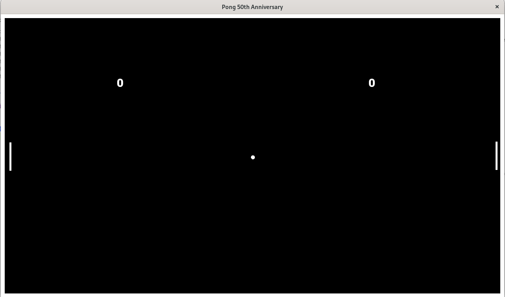

# Pong 50th Anniversary

#### sem04-cpp-project
 
 

## Technologies
* C++ with dynamically linked SFML library (v. 2.5.1)
* VS Code IDE

## How to?
1. Install [SFML library](https://github.com/SFML/SFML) to `/usr/local/SFML/` path   Optionally you can change paths in Makefile (if prefer terminal use) or change paths in tasks.json in .vscode directory (if prefer GUI)
2. `export LD_LIBRARY_PATH=/usr/local/SFML/lib`   Or another destination (both terminal and GUI)
3. `make all` or click run button in pong.cpp file
4. Enjoy 50th Anniversary Pong edition

## Controls
* Start game - click one of player controls
* Left player:
    * W - moves up
    * S - moves Down
* Right player:
    * ↑ - moves up
    * ↓ - moves down
* Pause - only possible when one player earns point; simply do not click buttons starting game

## Rules
Do not allow ball touch wall you protect! If ball touches your wall your opponent earn point.  
Game ends when one of players (winner) earn 10 points.

## Screens

